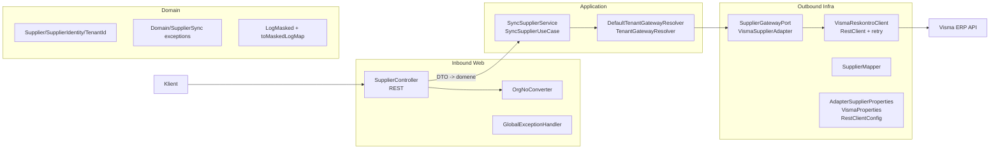
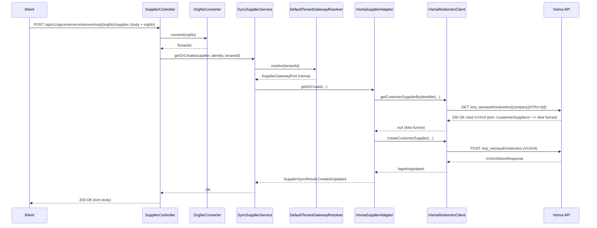

# Arkitektur
Dette dokumentet beskriver hvordan appen er bygget og hvordan et kall flyter gjennom lagene slik den fungerer nå.

## Lagdelt oversikt

## Kallflyt (POST /org/{orgNo}/supplier)

## Komponenter
- **Inbound Web**: [`SupplierController`](src/main/kotlin/no/novari/flyt/egrunnerverv/okonomi/infrastructure/inbound/web/SupplierController.kt) tar imot kall, validerer DTO med Jakarta Validation, og bruker [`OrgNoConverter`](src/main/kotlin/no/novari/flyt/egrunnerverv/okonomi/infrastructure/inbound/web/config/OrgNoConverter.kt) for å sikre gyldig orgnummer og mappe til tenant. [`GlobalExceptionHandler`](src/main/kotlin/no/novari/flyt/egrunnerverv/okonomi/infrastructure/inbound/web/error/GlobalExceptionHandler.kt) mapper domene-/valideringsfeil til konsistente [`ErrorResponse`](src/main/kotlin/no/novari/flyt/egrunnerverv/okonomi/infrastructure/inbound/web/dto/ErrorResponse.kt) med [`ApiErrorCode`](src/main/kotlin/no/novari/flyt/egrunnerverv/okonomi/infrastructure/inbound/web/error/ApiErrorCode.kt).
- **Application**: [`SyncSupplierService`](src/main/kotlin/no/novari/flyt/egrunnerverv/okonomi/application/supplier/SyncSupplierService.kt) implementerer [`SyncSupplierUseCase`](src/main/kotlin/no/novari/flyt/egrunnerverv/okonomi/application/supplier/SyncSupplierUseCase.kt). Kaller [`TenantGatewayResolver`](src/main/kotlin/no/novari/flyt/egrunnerverv/okonomi/application/tenant/TenantGatewayResolver.kt) for å finne riktig [`SupplierGatewayPort`](src/main/kotlin/no/novari/flyt/egrunnerverv/okonomi/domain/ports/out/SupplierGatewayPort.kt) basert på tenant.
- **Domain**: [`Supplier`](src/main/kotlin/no/novari/flyt/egrunnerverv/okonomi/domain/model/Supplier.kt), [`SupplierIdentity`](src/main/kotlin/no/novari/flyt/egrunnerverv/okonomi/domain/model/SupplierIdentity.kt) (sikrer én identitet), [`TenantId`](src/main/kotlin/no/novari/flyt/egrunnerverv/okonomi/domain/model/TenantId.kt). Maskering av sensitive felt via [`@LogMasked`](src/main/kotlin/no/novari/flyt/egrunnerverv/okonomi/domain/logging/LogMasked.kt) og [`toMaskedLogMap()`](src/main/kotlin/no/novari/flyt/egrunnerverv/okonomi/domain/logging/Extensions.kt).
- **Outbound Infra (Visma)**: [`DefaultTenantGatewayResolver`](src/main/kotlin/no/novari/flyt/egrunnerverv/okonomi/infrastructure/tenant/DefaultTenantGatewayResolver.kt) ser opp adapter-navn i [`AdapterSupplierProperties`](src/main/kotlin/no/novari/flyt/egrunnerverv/okonomi/infrastructure/config/AdapterSupplierProperties.kt) og henter Spring-bean. [`VismaSupplierAdapter`](src/main/kotlin/no/novari/flyt/egrunnerverv/okonomi/infrastructure/outbound/visma/adapter/VismaSupplierAdapter.kt) oversetter Visma-feil til domeneunntak. [`VismaReskontroClient`](src/main/kotlin/no/novari/flyt/egrunnerverv/okonomi/infrastructure/outbound/visma/service/VismaReskontroClient.kt) håndterer REST-kall, OAuth2 client-credentials, retry (Spring Retry) og mapping til/fra XML via [`SupplierMapper`](src/main/kotlin/no/novari/flyt/egrunnerverv/okonomi/infrastructure/outbound/visma/mapper/SupplierMapper.kt). Tom `customerSuppliers` i Visma-respons (200 OK) tolkes som “ikke funnet” og utløser opprettelse; andre feil gir 500. OAuth2-klientverdier og `legacy-auth` settes via miljøvariabler/secrets i Kubernetes (casing beholdes fra 1Password); `application.yaml` inneholder kun ikke-sensitive default-verdier.
- **Konfig**: [`AdapterSupplierProperties`](src/main/kotlin/no/novari/flyt/egrunnerverv/okonomi/infrastructure/config/AdapterSupplierProperties.kt) mappe orgNo → tenant → adapter. [`VismaProperties`](src/main/kotlin/no/novari/flyt/egrunnerverv/okonomi/infrastructure/outbound/visma/config/VismaProperties.kt) styrer base-URL, legacy-auth header, selskapsmapping (tenant → company), timeout og retry-parametere. [`VismaRestClientConfig`](src/main/kotlin/no/novari/flyt/egrunnerverv/okonomi/infrastructure/outbound/visma/config/VismaRestClientConfig.kt) bygger `RestClient` med XML-konverter, OAuth2 og tidsavgrensninger.

## Validering og feil
- DTO-validering: Regex på fødselsnummer/orgnr (kan være tomt) og krav om at kun én identifikator settes ([`SupplierIdentity.from`](src/main/kotlin/no/novari/flyt/egrunnerverv/okonomi/domain/model/SupplierIdentity.kt) kaster [`MissingIdentifierException`](src/main/kotlin/no/novari/flyt/egrunnerverv/okonomi/domain/error/SupplierIdentityExceptions.kt)/[`MultipleIdentifiersException`](src/main/kotlin/no/novari/flyt/egrunnerverv/okonomi/domain/error/SupplierIdentityExceptions.kt)).
- Tenant-validering: [`OrgNoConverter`](src/main/kotlin/no/novari/flyt/egrunnerverv/okonomi/infrastructure/inbound/web/config/OrgNoConverter.kt) avviser ukjente orgnummer og mapper til tenant; [`DefaultTenantGatewayResolver`](src/main/kotlin/no/novari/flyt/egrunnerverv/okonomi/infrastructure/tenant/DefaultTenantGatewayResolver.kt) kaster hvis mapping eller gateway mangler.
- Leverandørflyt: Visma-klienten kaster egne unntak for hente/opprette/manglende selskapsmapping; adapter oversetter til [`SupplierSyncException`](src/main/kotlin/no/novari/flyt/egrunnerverv/okonomi/domain/error/SupplierSyncException.kt)-typer. Global handler returnerer passende HTTP/feilkoder.
- Fallback: Alle andre feil gir 500 med `UNKNOWN_ERROR`.

## Logging
- Strukturerte logger (Logstash) med maskering av annoterte felt; identiteter logges med stjerner der det er påkrevd. Hendelser rundt Visma-kall og selskapsoppslag logges med `kv(...)`.

## Drift/videre arbeid
- Tenant → adapter- og tenant → company-mapping må være komplett for alle tenants som skal bruke Visma, ellers feiler oppstart ([`AdapterConfigurationValidator`](src/main/kotlin/no/novari/flyt/egrunnerverv/okonomi/infrastructure/config/AdapterConfigurationValidator.kt)).
